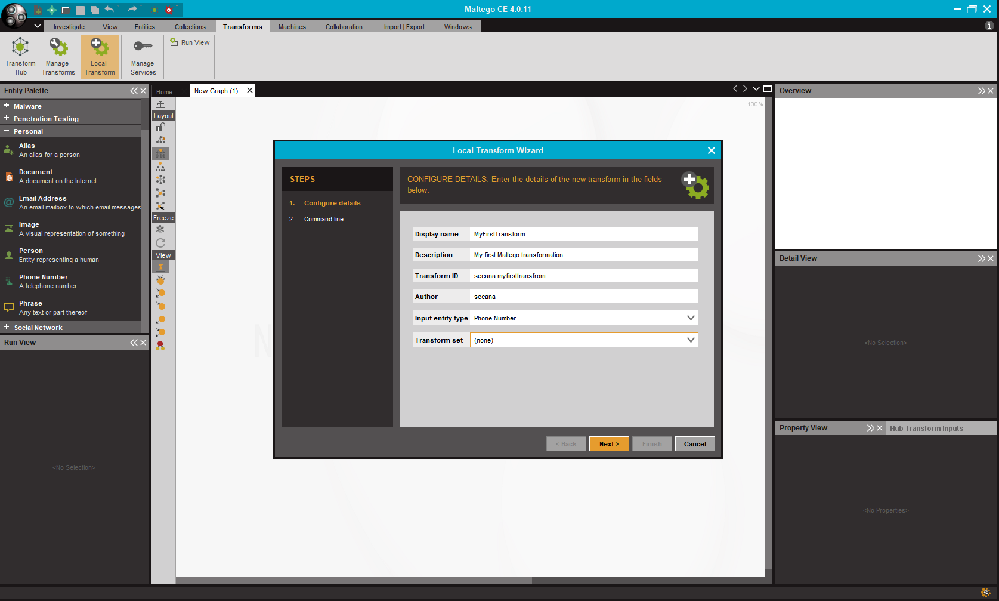
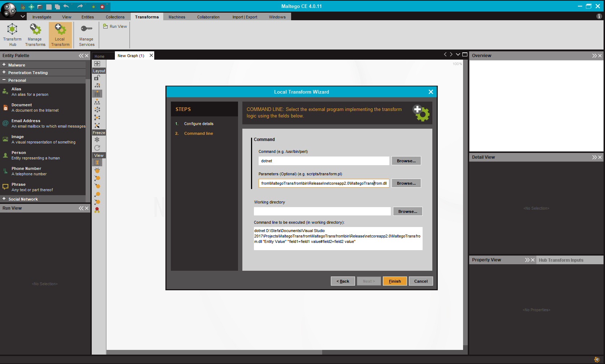
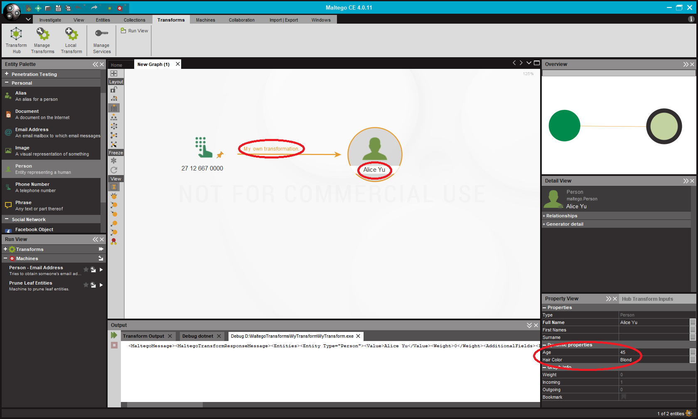

# TransNet
TransNet is a .Net Standard library to create [Maltego](https://www.paterva.com/web7/buy/maltego-clients.php) transformations.

[](https://raw.githubusercontent.com/secana/TransNet/master/LICENSE)
[](https://ci.appveyor.com/project/secana/transnet/branch/master)
[](https://www.nuget.org/packages/TransNet/)

## Writing a transformation with *TransNet*
The following example shows how to write a Maltego transformation with *TransNet*.

### Install TransNet into your project
*TransNet* is a .Net Standard 2.0 library which means it runs with the .Net Framework and with .Net Core under Windows, Linux and Mac.
To use *TransNet* in your project just install the [TransNet Nuget package](https://www.nuget.org/packages/TransNet/) into your project.

### The Code
Writing a transform is pretty straight forward. Maltego will call your transformation with command line arguments, which are parsed by *TransNet*. 
The resulting entities which you want to return have to be printed to *stdout*.

A minimal transformation which returns a "Person" entity looks like this:

```csharp
using System;
using TransNet;

namespace MyTransform
{
    class Program
    {
        static void Main(string[] args)
        {
            // Create a new transform based on the command line input from Maltego.
            var transform = new Transformation(args);

            // Add an entity to return.
            var person1 = new Entity("Person", "Alice Yu");

            // Add the entity to return to the transformation.
            transform.Entities.Add(person1);

            Console.WriteLine(transform.TransformToXML());
        }
    }
}

```

The example below shows how you can add additional fields to your returned entity and how to add an edge label with some properties.

```csharp
using System;
using System.Collections.Generic;
using TransNet;

namespace MyTransform
{
    class Program
    {
        static void Main(string[] args)
        {
            // Create a new transform based on the command line input from Maltego.
            var transform = new Transformation(args);

            // Add an entity to return.
            var person1 = new Entity("Person", "Alice Yu");

            // Add additional fields to the entity.
            var person1Age = new Entity.AdditionalField("Age", "Age", "45");
            var person1HairColor = new Entity.AdditionalField("HairColor", "Hair Color", "Blond");
            person1.AdditionalFields.Add(person1Age);
            person1.AdditionalFields.Add(person1HairColor);

            // Adding an edge label.
            person1.AddEdgeLabel("My own transformation.", new List<Tuple<string, string>>
            {
                // Adding edge properties.
                new Tuple<string, string>("My first edge property", "My first edge property value"),
                new Tuple<string, string>("My second edge property", "My second edge property value")
            });

            // Add the entity to return to the transformation.
            transform.Entities.Add(person1);

            Console.WriteLine(transform.TransformToXML());
        }
    }
}
```

#### Access field values
If your transformation needs some field values from the input entity provided by Maltego to your transformation via command line arguments use this:
```csharp
var fieldValue = transform.InputArguments["fieldName"];
```
This lets you access the field "fieldName" from the input entity.


#### Debug prints
If you need to output any debug information to Maltego which gets shown in the output panel use:

```csharp
transform.PrintDebug("My debug message");
```

To set the Maltego progress bar to a specific percentage while your transformation runs use:

#### Progress bar
```csharp
transform.PrintProgress(50);
```
This will set the progress bar to 50%.

## Add a transformation to Maltego
To add your own transformation to Maltego follow the next steps:

    1. Go to the "Transforms" tab.
    2. Click on "Local Transform".
    3. Configure the details.
      1. Add a name and description for your transformation.
      2. Add an *unique* transformation ID.
      3. Select the input entity type. Your transformation will be available for this input type.
    4. Configure the command.
      1. Add your transformation executable here.
    5. Click "Finish".
      



## Using the transformation in Maltego
After you've added your transformation to Maltego for one input entity you can use your transformation the following way:

    1. Add one item of the entity type you selected as input to the graph.
    2. Right click the entity and select your transformation under "Local Transforms".



If you click on the edge, you will find your added edge properties there, too.
